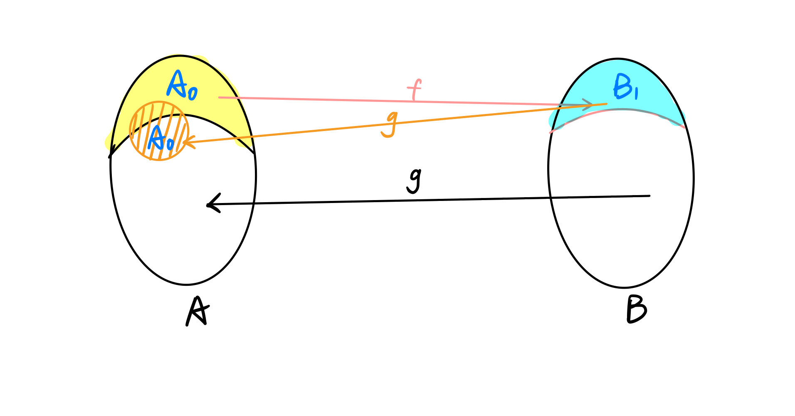

## 集合论
> 作者：曲桐希

### 0 预备知识   
在高中，你应该学习过以下知识点：
- 描述集合的方法：自然语言表示，列举法，描述法
- 集合的分类：有限集，无限极，空集
- 常用集合：自然数集，整数集，实数集
- 子集和真子集的概念
- 集合运算：交，并，补
- 一些简单的集合公式，比如A的补集的补集是它自身
- 数子集个数

您应该掌握“小学二年级”的数学内容：
> 小学二年级： ZS老师用于形容某些小时候就应该学过的数学知识时会描述为“这是小学二年级知识点，不知道的借本小学教材看一看。”

### 1 什么是集合
#### 1.1 类与集合
​		我们介绍过很多集合的性质，但是对于什么是集合，高中课本上对集合的描述为“一般的，我们把研究对象统称为元素，把一些元素组成的总体叫作集合”[1]，或者我们可能把集合理解成一个装着一些东西的盒子。但当我们真的这样定义集合的时候。我们将陷入巨大的麻烦之中！
**罗素悖论（ Russell Paradox）**：定义一个集合如下：$S = \{ x | x \notin x\} $，也就是说，把一个集合定义为不包含自身作为元素的所有集合的集合，那么$S \in S$吗？

- 如果$S\in S$，根据S的定义，S不包括这样的集合，所以$S\notin S$
- 如果$S\notin S$，根据S的定义，S应该包括这样的集合，所以$S\in S$

​		这样的集合不存在与这样的集合是空集是两个概念！假如S是空集，空集不是空集的元素，所以$S\notin S$，所以S应该包含空集，这是矛盾的！我们只能说，这样的集合S是不存在的。
与罗素悖论相类似的悖论还有很多：
**说谎者悖论（Liar Paradox）**：这句表述是错误的。
​		如果这句话本身是错的，那这句话就是对的；如果这句话是正确的，那么它应该是错误的。这个悖论引发我们对命题的真值与含义的思考，也即命题的含义为真与命题的真值为真可能是不一致的。于是，在公理化数理逻辑中，我们从公理出发，当且仅当该命题可以被证明时其真值为真，一个命题只有在特定的模型和语义下才有含义，详细了解请参考数理逻辑教材。
**理发师悖论（Barber’s Paradox）**：有一个小村子里只有一个理发师，他只给那些不给自己剪头发的人剪头。那么，他给自己理发吗？
**刽子手悖论（Unexpected Hanging Paradox）**：法官对囚犯说：下周七天中，囚犯将在某一天的中午执行绞刑，但囚犯在行刑的当天之前并不能推断出中午一定会行刑。用集合的语言表示如下：
$$D=\{d|如果在星期d行刑，那么在星期d之前都无法推断行刑时间\} $$
那么D集合包含的元素有哪些呢？
​		囚犯进行了以下推理：如果行刑在最后一天，即前六天没有行刑，那么他在周六下午就可以知道周天要行刑，因此第七天不会行刑。那么行刑只能在前六天，那么周六也不会行刑，因为如果行刑在周六，即前五天都不会行刑，那么他在周五下午就知道行刑只能在周六和周天，而在前面他已经排除了周天，所以行刑只能在周六。以此类推，他发现行刑不能在七天中任何一天。因此，他认为他将不会被执行绞刑。
​		但对于刽子手而言，他可以先选择在任何一天的中午执行绞刑，因为囚犯确实无法推断出这一天会行刑！
​		引发上述悖论的原因在于这些集合被描述为具有某种特定性质的元素的整体，所以我们需要限制对元素性质的描述，不是随便什么描述都可以生成一个集合的！
​		这些悖论表明下面的概括公理（axiom schema of comprehension）是不成立的。

> 在一开始，人们就企图将集合论公理化，就在弗雷格即将完成他从集合论出发建立的纯逻辑的数学体系时，罗素给他写了一封信，信里包含了后来著名的罗素悖论。弗雷格的构建的数学大厦轰然倒塌，他不得不承认，自己的公理是有问题的。

**概括公理（伪）**：如果P是某种性质，那么一定存在集合$Y = \{x:P(x)\}$
		但是这种描述事物的方法是很方便且强大的，后来数学家管用这种方法定义出来的东西叫做**类（class）**。类就是具有某种性质的一类元素的整体。

> 类（class）：如果$\phi(x,p_1,...,p_n)$是公式，其中$x$是自由变元，$p_i$是约束变元，我们称$C=\{x:\phi(x,p_1,...,p_n)\} 是一个类。$

​		显然罗素悖论提到的S只是一个类。对于类S，$S\in S$这个问题不再有意义，因为类S不会是其自身的元素。对于那些会导致罗素悖论的类，我们称其为**真类(proper class)**，所以之后再定义集合的时候要仔细想一想，你定义的东西真的是一个集合吗。
对于集合，我们还有其他的一些要求，比如一个集合的元素不能只有它自己，这个对应的公理是**基础公理或正则公理（Axiom of Regularity）**，这个公理有两种形式上不同但是表达含义是一致说法：
**公理 1.1**
（1）基础公理：$\forall x(x\neq \emptyset \rightarrow \exist y(y \in x \land x \cap y = \emptyset)) $
（2）正则公理：每一个非空集合有$\epsilon - $最小元。
借用这个性质我们可以证明下面一件事情：
**例1.1**
​		不存在一个无穷的集合序列$\{S_n\}_{n\in \mathcal{N}}$，使得对于所有$n\in \mathcal{N}, S_{n+1}\in S_n$
证明：
采用反证法，假设存在这样的$\{S_n\}$，考察$S=\{S_n|n\in\mathcal{N}\} $，也即S是由$\{S_n\}$的前n项构成的集合。根据基础公理，S中一定存在一个元素$S_x$满足$S_x \in S \land S_x \cap S = \emptyset$
从而，$S_{x+1} \in S_x \in S$，且由于$S_x \cap S = \emptyset $可知$S_{x+1}\notin S_x$
这与序列$\{S_n\}_{n\in \mathcal{N}}$的定义相矛盾！

#### 1.2 集合与关系
**定义 1.1（集合运算）**
**交（intersection）**：$A\cap B = \{x|x\in A \ and \ x\in B\}$
**并（union）**：$A\cup B = \{x|x\in A \ or \ x\in B\}$
**补（complement）**：$A^c = \{x|x\in U \ and \ X\notin A\}$，其中U是全集。
**差（difference）**：$A  \backslash  B =A - B= \{x|x\in A \ and \ X\notin B\}$
交并补这几个操作我们在高中就熟知了，接下来我们重点关注差集的性质。我们可以轻松证明以下两条性质：
**不满足交换律**：$A\backslash B \neq B\backslash A$
**不满足结合律**：$A\backslash (B\backslash C)\neq (A\backslash B)\backslash C$
**定理 1.1 (德摩根律，De Morgan Law)**
对于任意的集合A,B,C，满足：
$$A\backslash (B\cup C)=(A\backslash B)\cap(A\backslash C)$$证明：
对于所有的$x\in A\backslash (B\cup C)$，根据定义，有$x\in A$且$x\notin (B\cup C)$,所以$x\notin B$且$x\notin C$，这样的元素$x$也一定同时满足$x\in A\backslash B, \ x\in A\backslash C$，从而有：
$$A\backslash (B\cup C) \subseteq (A\backslash B)\cap(A\backslash C) $$对于所有的$x\in (A\backslash B)\cap(A\backslash C)$，有$x\in (A\backslash B)$且$ x\in (A\backslash C)$，所以$x\in A， x\notin B， x\notin C$，从而有：
$$(A\backslash B)\cap(A\backslash C)\subseteq A\backslash (B\cup C) $$综上所述，定理成立，即
$$A\backslash (B\cup C)=(A\backslash B)\cap(A\backslash C)$$
**定义1.2 （笛卡尔积， Cartesian product）**
> 笛卡尔（Descartes）是法国数学家，哲学家，物理学家，而笛卡尔积中出现的单词Cartesian是为了纪念笛卡尔对现代科学做出的伟大贡献，将他名字中的“cartes”后面加上“-ian”变为形容词，意为“笛卡尔的”。

$$X \times Y = \{(x,y)|x\in X,y\in Y\} $$**例1.2**下面举出两个例子来辅助理解：
（1）$ X=\{1,2\},  Y=\{2,3,4\},  X×Y=\{(1,2),(1,3),(1,4),(2,2),(2,3),(2,4)\}$
（2）我们在高中就接触过的欧几里得坐标平面（就是有x轴、y轴的那个平面）的实质就是两个数轴的笛卡尔积，也可以表示为数轴的平方（square），记为$P = \mathcal{R}^2 $。
在介绍笛卡尔积的时候，出现了一个新的符号$(x,y)$，这个东西称为**有序对**（ordered pair），与集合的区别在于其有序性，也即$(x,y)\neq (y,x)$.
**定义1.3 （有序对）**
$$(x,y)=\{\{x\},\{x,y\} \} $$其中一个元素是另一个元素的子集，这样两个元素的先后顺序就被记录下来了.这样定义了有序对之后，我们就可以避免对“有序”的不正规的描述了。集合的重要性在于它是现代数学的基石，数学上几乎所有的事物都可以看做集合。
**定义1.4 （n个集合的笛卡尔积)**
$$X_1×X_2×...×X_n=\{(x_1,x_2,...,x_n)|x_1\in X_1,...,x_n\in X_n \} $$显然，这个操作不满足交换律，但是满足结合律。有了有序对，就是二元组的正式定义之后，我们是这样定义n-元组的：
$$\begin{align*}
    (a,b,c) &= ((a,b),c)\\
    (a,b,c,d) &= ((a,b,c),d)\\
    &\cdots\\
    (a_1,...,a_{n+1})&=((a_1,...,a_n),a_{n+1})
\end{align*} $$
“有序”意味着当且仅当$a_1=b_1,...,a_n=b_n$，我们才认为$(a_1,...,a_n)$与$(b_1,...,b_n) $是相等的。
当我们对同一个集合做n次笛卡尔积时，我们可以简单的将其记为某个集合的n次幂的形式，例如$\mathcal{R}\times\mathcal{R}=\mathcal{R}^2$表示欧几里得平面，$\{0,1\}^n$表示一个长度为n的比特串。

> 或许你可能会想，那我能不能将笛卡尔积拓展到无穷项，或者无穷个集合的交、并表示什么。从有限到无穷并不是一个简单的过程，我们暂时也不会去研究就这些问题。

**定义1.5 （二元关系，binary relation）**

一个有序数组的集合叫做一个二元关系。

​		比如我们上文提到的由笛卡尔积生成的集合就是一个二元关系。
​		我们说**X上的关系**（a relation on X），是指集合中所有有序对的两个元素都来自于同一个集合X。类似的，我们可以定义**n元关系**，即一个n-元组的集合称为n元关系，在大多数情况下，我们把二元关系简称为**关系**（relations）。对于X上的关系R，如果$(a,b)\in R$，那们我们也可以表示为$a \ R \ b$

> 注意，在这里关系既指一种集合元素之间运算，比如“大于”，“等于”这种运算本身，又指通过这种运算生成的集合。在{1，2，3}上定义的小于关系就是$ \{(1,2),(2,3),(1,3)\} $。因为1<2,  2<3,  1<3.

**定义1.6 （关系的性质）**
令R是集合X上的关系：
（1）R是**自反的**（reflexive），若对于任意的$a\in X$，有$(a,a)\in R$
（2）R是**对称的**（symmetric），若$(a,b)\in R\rightarrow (b,a)\in R$
（3）R是**反对称的**（antisymmetric），若$(a,b)\in R\land (b,a)\in R\rightarrow a=b $
（4）R是**强反对称的**（strongly antisymmetric），若$(a,b)\in R\rightarrow (b,a)\notin R$ 
**例1.3**对于X={1，2，3}，分别给出一个满足自反性，对称性，反对称性和强反对称性的关系。
解：
（1）对于自反性，需要注意是对X中所有的元素都要成立，比如$\{(1,1),(2,2),(3,3)\}$就是一个自反的关系。
（2）对称性不要求X中所有元素都满足，关系$\{(1,2),(2,1)\}$就是一个对称的关系。
（3）（4）注意反对称和强反对称的差别，与对称性完全相反的表述是强反对称性，即$(a,b)$在R中那么$(b,a)$一定不在，而反对称说的是，当a,b不相同时$(a,b)$在那么$(b,a)$一定不在，而$(a,a)$是可以包含的。例如X上的$\leq $关系  $\{(1,1),(1,2),(1,3),(2,2),(2,3),(3,3) \}$是反对称的，而$< $关系 $\{(1,2),(1,3),(2,3)\}$是强反对称的。
**定义1.7 传递性（transitive）**
集合X上的关系R具有传递性，若：
$$(a,b)\in R\land (b,c)\in R\rightarrow (a,c)\in R $$在上文中提到的$\leq $关系、$< $关系都具有传递性，由于传递性，我们自然可以列出一个长链，比如：$1<2<3<4<5<\cdots$，对于这个链中的元素，我们按顺序任选两个，它们组成的有序对都应该属于<关系。对于X上的某一个传递的关系R，我们希望通过添加有序对的方式得到一个具有传递性的新集合，且得到的集合为包含有给定关系R的最小传递关系，这个新的集合称为R的**传递闭包**（transtive closure），它的正式定义如下：
> 这里所说的某个传递关系R不是指R本身是传递的，而是说对于某个R，使它具有传递性,然后研究得到的$R^\star$。可以研究传递闭包是因为不会有关系R是无法添加传递性的，相类似的，我们有自反闭包和对称闭包，但没有反对称闭包。

**定义1.8 （传递闭包）**
$$R^{\star}=R\cup \{(a,b)|\exist c_1,...,c_k  \ s.t. \ (a,c_1),(c_1,c_2),...,(c_{k-1},c_{k}),(c_{k},b)\in R \} $$一个朴素的想法就是遍历R，对于R中每个有序对中的元素c，当寻找到$(a,b), (a,c)$时就添加一个$(b,c)$，然后一轮一轮不断寻找下去，直到不再添加元素为止。
> 简单分析一下正确性：
> 对于定义，$(a,c_2)$在第一轮就被加入算法，因为$(a,c_1)$原来就有，在第二轮，显然$(a,c_3)$可以被加入到算法中，这样我们通过有限轮的运算后，就可以得到$(a,b)$了。

​		但是这个算法效率并不是很高。假设输入的集合有N个元素，那么我们需要至多N-2轮算法来确保所有的(a,b)都被加入到集合中。而对于每一轮，需要遍历集合来寻找所有可能的a，b，c，这需要$N^3$步，从而整个算法需要$N^4-2N^3$步操作才能完成。接下来我们将介绍一个更快的算法。
> 在算法课上我们会引入时间复杂度的概念来衡量一个算法的效率，这个朴素想法的时间复杂度是$O(N^4)$的。

**定义1.9 （沃舍尔算法，Warshall Algorithm）**
> 斯蒂芬·沃舍尔（Stephen Warshall），1935-2006，美国计算机科学家。1956年，沃舍尔毕业于哈佛大学，获得数学学士学位，但由于在当时缺少他感兴趣领域的研究生课程，因此没有获得更高学位。沃舍尔曾经为了他的算法的正确性与朋友打赌，最终获得了一瓶朗姆酒。
> 
沃舍尔算法从头开始遍历集合X每一个元素，对于元素i，如果(a,i)和(i,b)都在R中，则将(a,b)加入R。
如果我们用一个矩阵表示关系R，即对于$X=\{x_1,x_2,...,x_n\}$上的关系R，如果$x_i R x_j$（也就是说$(x_i,x_j)\in R$），则将矩阵M(R)的第i行第j列的值设为1，否则设0.这样得到的矩阵成为**关系矩阵**。
**例1.4 （关系矩阵）**
对于例1.3中的X和<关系，对应的关系矩阵如下：
$$\begin{pmatrix}
    0 & 1 & 1\\
    0 & 0 & 1\\
    0 & 0 & 0
\end{pmatrix} $$
用关系矩阵重新描述沃舍尔算法的内容如下：
- 判断关系矩阵的每一行第一个元素是否为1，若为1，则将该行每个元素与第一行的元素逐个做或运算的结果作为该行该元素的新值。
- 结束后，判断第二个元素是否为1，若为1，将该行每个元素与第二行的元素逐个做或运算的结果作为该行该元素的新值。
- 依此类推

**例1.5 （沃舍尔算法运行过程）**
$X=\{1,2,3,4,5\}, \ R=\{(4,2),(2,1),(1,3),(3,5) \} $,观察(4,5)是怎样被添加进来的。
- 检查元素1，寻找(a,1)和(1,b):  (2,3)被添加进来，因为(2,1)和(1,3)在R中。
- 检查元素2，寻找(a,2)和(2,b): (4,3)被添加进来，因为(4,2)和(2,3)在R中。
- 检查元素3，寻找(a,3)和(3,b): (4,5)被添加进来，因为(4,3)和(3,5)在R中。
> 当然算法还要继续，且每一步可以添加不只一个元素，比如第2步时(4,1)也被添加了，上面的步骤只是为了展示(4,5)的添加。

**推论1.1 （时间复杂度）**
		沃舍尔算法的时间复杂度为$O(N^3)$，通俗来讲，即只需要$N^3$数量级的步数就可以完成传递闭包的计算。
证明：
		沃舍尔算法遍历一次集合需要N步操作，每一次需要寻找a和b两个值，不同的a、b组合有$N^2$个，所以需要$N^2$步，综上所述，沃舍尔算法需要$N^3$步就可以计算出传递闭包。
**定义1.10** 等价关系（equivalence relations）

 
X上的关系R是等价关系，当且仅当R是自反的，传递的，对称的。

**例1.6** 证明同余关系是等价关系。
- 自反性：就是说自己和自己是同余的，这显然成立。
- 传递性：a和b同余，b和c同余，所以a和c同余。这个在我们“小学二年级”学带余数除法的时候就知道了，因为a,b,c都是除数的某个倍数加上余数。
- 对称性：a和b同余，则b和a也同余。

**例1.7** 大于关系、大于或等于关系不是等价关系。
对于不相同的两个元素a、b，大于和大于或等于关系都不满足对称性。即a > b和b > a不能同时成立, a $\ge$ b和b $\ge$ a不能同时成立。
**定义 1.11**（划分，partition）
X的一个划分P是一个只包含X的子集的集合，且满足：
（1）P中任意两个元素是不相交的。
（2）P中所有元素的并集是集合X。
划分P的元素（同时是X的子集）被称为**等价类**（equivalence class）。
**例1.8**（划分）
$X = \{1,2,3,4,5\}$，则$P=\{\{1,2,3\},\{4\},\{5\} \} $是X的一个划分。
**定理1.2**

X上的等价关系R提供了X的一个划分。

证明：   
> 思路：X上有等价关系R，也就是说X中有一些元素是互相等价的，我们将这些互相等价的元素放到一个子集里（如果某个元素只与自己等价，那么我们构造的子集就是只含它自己的单元素集）。这样我们得到的这些子集应该就是一个划分了，接下来我们证明这样的子集满足划分的性质。

令$P = \{\{y|(x,y)\in R\}|x\in X\}$即对于元素x，与其有等价关系(x,y)的所有y被放到一个集合里。
首先证明P中元素不交：
取$p,\ p^\prime\in P \ (p\neq p^\prime)$，假设两者有交集，即$\exist z,\ z\in p=\{y|(x,y)\in R\},\ z\in p^\prime = \{y|(x^\prime,y)\in R\} $。由于$z\in p $则$(x,z)\in R$，$z\in p^\prime $则$(x^\prime,z)\in R$。对于$p^\prime $中任意一个$y^\prime$而言，有$(x^\prime, y^\prime)\in p^\prime $，由于对称性$(z,x^\prime)\in R$，再由传递性，$(x,z),(z,x^\prime),(x^\prime, y^\prime)\in R $，可以得到$(x,y^\prime)\in R $，根据$p $的定义可以知道，$y^\prime\in p $。从而$p^\prime$所有的元素都在$p $中，也即$p^\prime \subseteq p$。对于上文的证明，交换$p,\ p^\prime$的地位，不难证得，$p \subseteq p^\prime$，也即$p=p^\prime$，与最开始的定义矛盾。
然后我们来证明P的所有元素的并是X：
由于P的元素是X的子集，将X的一些子集做并集得到的集合不会含有X以外的元素，从而$\underset{p\in P}{\bigcup}p \subseteq X$。另一方面，R是等价关系，是自反的，对于任意的$x\in X$，有$(x,x)\in R$，从而$x\in \{y|(x,y)\in R\},\ x\in \underset{p\in P}{\bigcup}p $，也即$ X\subseteq \underset{p\in P}{\bigcup}p$，综上$X = \underset{p\in P}{\bigcup}p$
**例1.8** 考虑极限为0的正实数数列构成的集合$X=\{\{a_n\}|\lim_{n\rightarrow\infty}a_n=0 \}$，证明关系$R = \{(\{a_n\},\{b_n\})|\lim_{n\rightarrow\infty}\frac{a_n}{b_n} = 1\}$是一个等价关系。
证明：
显然R是自反的。
对于任意的$(\{a_n\},\{b_n\})\in R$，有$\lim_{n\rightarrow\infty}\frac{a_n}{b_n} = 1$，从而$\lim_{n\rightarrow\infty}\frac{b_n}{a_n} = \frac{1}{\lim_{n\rightarrow\infty}\frac{a_n}{b_n}} = 1$，也即$(\{b_n\},\{a_n\})\in R$，所以R是对称的。
如果$(\{a_n\},\{b_n\})\in R,\ (\{b_n\},\{c_n\})\in R$，则$\lim_{n\rightarrow\infty}\frac{a_n}{c_n}=\lim_{n\rightarrow\infty}\frac{a_n}{b_n}\cdot\frac{b_n}{c_n}=\lim_{n\rightarrow\infty}\frac{a_n}{b_n}\cdot\lim_{n\rightarrow\infty}\frac{b_n}{c_n}=1$，所以R是传递的。
事实上，R在衡量数列的递减速率，$\{1/n\}$和$\{2/(2n+1)\} $在一个等价类中，而$\{1/2n\}$不在它们的等价类中，因为$\{1/2n\}$的递减速率是$\{1/n\}$的2倍。

> 具体了解“递减速率”的概念请参考数学分析。

#### 1.3 映射与函数
高中的定义：

> 关于定义域、像集的符号并没有统一的规定，不同的书上符号不同是很正常的。

​		设A和B是两个非空集合，我们说$f$是一个从A到B的**映射**（mapping）或**函数**（function），若对于任意的$x\in A$，存在$f(x)\in B$，记为$f: A\rightarrow B$。A被称为$f$的**定义域**（domain），记为$dom(f)$，B被称为$f$的**值域**（codomain），$\{f(x)|x\in A\}$为$f$的**像集**（range），记为$rng(f)$。
使用集合论的语言，我们可以这样定义一个函数：
**定义1.12** （函数）
​		设A和B是两个非空集合，我们说$f$是一个从A到B的**映射**（mapping）或**函数**（function），若在集合A和B之间存在一个二元关系R，且对于任意的$x\in A$，存在唯一的$y\in B$使得$(x,y)\in R$.
**定义 1.13**
（1）映射$f: A\rightarrow B$是一个**单射**(one-to-one)，若对于任意的$x,y\in A(x\neq y)$有$f(x)\neq f(y)$.
（2）映射$f: A\rightarrow B$是一个**满射**(onto)，若$f$的像集就是它的值域。
（3）映射$f: A\rightarrow B$是一个**双射**（或**一一映射**）(bijection)，若$f$既是单射，也是满射。

> 注意：不要把one-to-one当成一一映射，外国人一般用bijection来形容一一映射。

**定义1.14** （反函数，inverse function）
		若$f$是一个双射，则定义$f$的反函数（或逆映射）$f^{-1}:B\rightarrow A$如下：
$$f^{-1}(y) = x \ \mathrm{iff} \ f(x)=y$$

> iff是当且仅当的意思。

​		注意到双射是一种特殊的映射，但有时我们可能会需要研究一个任意的映射的逆，因此我们在某些需要的情境下定义**广义反函数**（generalized inverse function）。
>例子：在线性代数中，矩阵A可以视为线性变换(函数),将每个矢量映射到另一个矢量。它的逆矩阵（如果有）表示逆变换。然而，当矩阵为奇异的，我们可以定义它的广义逆矩阵作为矩阵G，使得AGA＝A。

**定义1.15**（函数复合）
设$f:A\rightarrow B, \ g: B\rightarrow C$，将$f$和$g$复合后得到函数$h$，记为$h=f\circ g$，对任意的$x\in A, \ h(x) = g(f(x))$.
> 注意 f 和 g 的顺序。

- 如果f和g都是单射，则h也是单射
- 如果f和g都是满射，则h也是满射
- 如果f和g都是双射，则h也是双射
- 如果h是单射，则f一定是单射，g不一定
- 如果h是满射，则g一定是满射，f不一定
- 如果h是双射，则f和g可能都不是双射

**泛函与函数式编程**
**定义1.16**（泛函，functional）
$f:A\rightarrow B$是一个**泛函**（或**算子**），若A和B中至少有一个是函数集合。
> 比如导数算子$\frac{d}{dx}$是一个泛函，因为它将函数映射为其导数。

**函数式编程**图灵（Turing）发现，$\lambda$演算是图灵完备的，从而一个算法可以表示为一个函数或泛函。

### 2 集合的大小
#### 2.1 判断集合大小引发的问题
对于有限集合，显然我们可以通过数元素个数来比较大小，但是，我们可以将这种方法拓展到无穷吗？
> 或许你可能已经开始觉得“无穷”这个词汇的含糊不清了，无穷和无穷之间，应该是有一些差别的，但是要怎样体现这些差别呢？在学完本节之后，相信你会重新认识“无穷”这个词汇。

数元素的方法显然是不好用了，但我们只是想要比较大小，于是我们可能会有下面的想法：
- 比如高中老师判断一个同学没来上课的方法可以是，看谁的位置是空着的。老师将同学和椅子相对应，或者说，老师尝试构造**学生到椅子之间的双射**，如果构造成功，则对应着学生们都来上课了。
- 另一个朴素的思维是，不论原来的篮子里面有多少个苹果，只要我再往篮子里面放苹果，则苹果一定会增多，这种思路是试图构造一个真子集关系，**一个集合应该比真子集更大**。

用数学的语言描述上面的思想，我们采用记号$|Z|$表示$Z$的“大小”，后面我们将看到，这个记号表示集合的势。比如我们想要比较整数集（记为$Z$）和偶数集（记为$E$）的大小：
- E是Z的真子集，则$|Z|>|E|$.
- 因为存在双射$f:Z\rightarrow E$，例如$f(x)=2x$，所以$|Z|=|E|$.
- 因为存在双射$f:Z\rightarrow subset(E)$，例如$g(x)=4x$，所以$|Z|<|E|$.

乍一看，这些想法都有各自的道理，产生完全不同的三种观点的核心问题，在于下面两条看似很自然合理的逻辑：
- 逻辑1： 两个集合大小相同，意味着在两个集合之间存在一个双射。
- 逻辑2： 任何集合比它的真子集大。

> 虽然直观上，我们倾向于第2条，但我们要注意到，第一条比第二条普适得多。对于两个没有真子集关系的集合，第二条逻辑无法判断了！而映射关系的构造是很普适的，在任何两个非空集合之间都可以构造映射！

​		现在我们承认了第一条逻辑，但我们依然无法判断Z和E的大小关系，因为第二个想法和第三个想法都成立！不过，似乎承认E比Z还大有些违和，因为真子集应该“不至于”比原来集合还大！所以，我们不是抛弃逻辑2，而是对它进行一些小小的修改，新的两条原则如下：

- 逻辑1： 两个集合大小相同，意味着在两个集合之间存在一个双射。
- 逻辑2： 任何集合**不小于**它的真子集。

这样，我们就可以判断出整数集的大小和偶数集的大小是**一样大**的！
> 有限和无限的差别真的很大！

#### 2.2 集合的势
这一小节我们来用数学语言描述上一小节的结论。
**定义2.1**（等势）
		我们说集合$x$和$y$**等势**，当且仅当它们之间存在一个**双射**。
		我们将$x$和$y$等势，记为$|x| = |y|$.
		我们说$x$的势**小于或等于**$y$的势，当且仅当存在$x$到$y$的**单射**，记为$|x| \le |y|$.
		我们说$x$比$y$**弱势**，记为$|x| < |y|$，当且仅当$|x|\le |y|\land |x|\neq |y|$
**定理2.1**（康托定理，Cantor）
		假设$S$是一个集合，$S$的幂集被定义成$2^{S} = \{x|x\subseteq S\}$.康托定理是说，任意一个集合$S$不会与它的幂集等势。

> 思路：想要证明康托定理，我们需要说明不存在从$S$到$2^S$的双射。我们采用反证法，假设存在一个双射$f:S\rightarrow 2^S$.我们想象将S中的元素按照某种顺序排列出来（虽然对于无穷集合可能是**无法**排列出来的），若第i个元素在子集$f(j)$中，则在表格(i,j)的位置写一个Y，否则写一个N，例如(2,2)的N表示第二个元素不在$f(2)$中。
> |    |1   |2   |3   |4   |... |
> |----|----|----|----|----|----|
> |1   |Y   |    |    |    |    |
> |2   |    |N   |Y   |    |    |
> |3   |    |    |Y   |    |    |
> |4   |    |    |    |N   |    |
> |... |    |    |    |    |    |
>
> 这个时候我们试图在幂集中找到一个新的元素（是一个原集合的子集），使其无法被这张表格表示出来，这样的话，我们就可以说明f 不是双射，从而产生矛盾了。
> 观察下面这个表格：
>
> |N   |Y   |N   |Y   |... |
> |----|----|----|----|----|
>
> 选取原表格的对角线，将N改为Y，将Y改为N，就得到了上面这一行，我们发现，这一行不属于原来的表格的任何一行。因为它与原来表格的每一行都至少有一个元素不相同。根据这一行的Y，N可以构造出一个子集，这个子集是无法被 f 所映射到的！从而我们得出矛盾，本题证毕。

证明：
		假定存在双射$f:S\rightarrow 2^S$.
		构造集合$T\in 2^S$（也即$T\subseteq S$）;
		如果$x\notin f(x)$，则$x\in T$，
		显然，不存在$x\in S$，使得$f(x)=T$.
		然而，由于$f$是双射，从而一定存在$x\in S$，满足$f(x)=T$.
		矛盾！

> 这个证明不依赖我们在前面想象的那个表格，也不关心我们能否将S的元素列出来。

​		其实，我们试图将S中的元素列出来，就是将S中每一个元素对应于一个自然数，就是一个将S与自然数集做映射的过程，而通过映射关系可以判断是否等势，与自然数等势是一个重要的概念，因为只要与自然数等势或弱势于自然数，就意味着这个集合是可列的，我们可以1,2,3,4,...这样一直数下去。
**定义2.2**（可数，countable）
​		我们说一个集合是**可数**的，若其与自然数集合的某个子集等势。
​		如果这个集合同时还是无限的，我们说这个集合是**无限可数集**。
​		任意不是可数的集合被称为**不可数集**（uncountable set）。
**推论2.1** 实数集是不可数的。

> **思路：** 在处理实数之前，我们可以先思考区间[0,1]上的实数是可数的吗。仿照康托定理的证明，我们不难想到，能否将[0,1]上的实数列出来，然后看看能否构造一个无法被列出的实数来。
> 于是，我们可以将[0,1]上的实数表示成无限小数，并假设有一种方法可以列出所有无限小数来，接着采用与之前类似的对角线构造方法，满足构造的新的数字与第一个数小数点后1位的数字不同，第二个数的小数点后2位的数字不同，依此类推。这样我们发现构造的数与列出的数字都不同！**[0,1]是不可数的！**
>   
> 那么，用这个方法罗列所有自然数，然后对角线构造，这样我们不是就证明了自然数不可数吗？！哈哈，当你实际操作的时候，就会发现，如果简单的将整数列出来，就会导致无法保证第j行第j列有数字，因为整数是不能在后面加0的！如果我们将整数反过来，比如1234表示成形如43210000...的数字串，但是，这样我们会发现，由于不存在**无限不循环**整数，也就是说对于一个整数，我们要能写出它的最高位，导致任何一个整数对应的数字串都应该以00000...结尾，也就是说，如果你希望通过对角线法得到一个整数，那么当位数足够多后，就应该一直是0，不能再变化了，从而构造失败了。
>   
> 读者不妨思考一下，既然这里特意提及**无限不循环**，那么，有理数是可数的吗？
> 但是我们依然可以通过某种特殊的**编码**手段，将实数与某个数字串一一对应，然后再使用对角线法。

		如图，我们将小数部分写在编码的奇数位，整数部分写在偶数位，并且均可以补0，这样我们就保证了实数与这个编码是一一对应的，且我们在后面可以添加0而不更改原来的意思。然后我们使用对角线法即可。

证明：
		采用反证法，假设实数集$R$是可数的。则一定存在一个自然数的子集$S$，和双射$f:S\rightarrow R$.
对于任意的实数$x$，用$r(x,i)$表示$x$小数部分第$i$位数字，$l(x,i)$表示x整数部分第$i$位数字。比如$r(11.231,2)=3$，$l(11.231,4)=0$.
对于每一个自然数$n$，

- 如果$n\in S$且n是偶数，则$r(z,n/2)=(r(f(n),n/2)+1)mod10$.
- 如果$n\in S$且n是奇数，则$l(z,(n+1)/2)=(l(f(n),(n+1)/2)+1)mod10$
  

这两步相当于在列出的表格里面，将对角线的每个数字都加1，从而保证构造的$z$与其他所有表项都不相同。由于我们需要说明的是不存在这样的子集，所以还要考虑可能某个自然数$n$无法被映射，对于这样的$n$，我们要：
- 如果$n\notin S$且n是偶数，则$r(z,n/2)=0$.
- 如果$n\notin S$且n是奇数，则$l(z,(n+1)/2)=0$.

显然，对于任意的$n\in S$，有$f(n)\neq z$.但是$f$是双射，矛盾！
**定理2.2** （巴拿赫，Banach）
对于集合$A$和$B$，如果存在映射$f: A\rightarrow B$和$g:B\rightarrow A$，则存在$A$的一个划分$P=\{A_0,A_1\}$以及$B$的一个划分$Q=\{B_0,B_1\}$，使得$B_1=f(A_0), A_1=g(B_0)$.
> 这个定理是说，对于$A$中的元素，要么只在$f$的原像集的子集$A_0$中，要么只在$g$的像集的子集$A_1$中，而且当我们对$A_0$中的元素应用$f$时，正好得到的像是$B_1$,对于$B$中元素也类似。

​		我们可以首先试着找一下哪些元素可以确定地被放在$A_0$或$A_1$里面，首先，在 A 中不是 B 的原像的元素一定在$A_0$里面，假设图中灰色部分对应于$g(B)$，则灰色部分之外的元素一定会属于$A_0$，接下来，我们考虑$A_0$里面的某个元素 s ，根据定理内容，$f(s)$应该被放入$B_1$里面，而$f(s)$这个元素可以被$g$映射回 A 中，对应于$g(f(s))$，这个元素应该在哪呢？还在$A_0$，因为$B_1=f(A_0)$，于是我们发现$A_0$中的元素一定被映射到$B_1$，$B_1$中的元素也一定被映射回到$A_0$，同理，$A_1$中的元素被映射到$B_0$，$B_0$中的元素被映射到$A_1$.

​		我们可以让$A$中所有没有原像的元素（就是 g 映射不到的那些元素）构成最开始的$A_0$（图中黄色部分），然后从其中的元素出发，将$f(s)$加入到$B_1$，如果$g(B_1)$不在$A_0$中，那么就将它加到$A_0$，如图中橙色部分所示。（对于$B_0$，我们可以在$B$中去掉$f$的像来得到一个最初始的$B_0$的子集，然后类似地将$B_0$和$A_1$进行扩张)

​		但是，这时我们不得不考虑下面这个明显的问题：还会有元素没有被分到$A_0$或$A_1$吗？

​		很不幸，无论运行多少次，我们都可能遗漏某些元素。由于 f 和 g 可能是多对一的映射，而我们在进行分类时，是不断重复$A_0$在 f 下的像属于$B_1$，$B_1$在 g 下的像属于$A_0$，也就是说，当存在多对一映射，某个被分类的元素可能会**丢失它的原像**！在之后的步骤里面我们也无法处理这些被丢掉的原像！
   
​		当然，我们可以想到，那在我向$A_0$添加元素的时候，同时将其原像加入到$B_1$就好了（$B_0$和$A_1$同理），只是这时，$B_1$就会有新的元素，我们还需要将这些元素的原像加入到$A_0$，直到没有新的元素为止。下面的图中展示了一个添加了3轮原像的过程，当标为黑色的元素被加入$A_0$，它的两个原像（蓝色的点）被加入$B_1$，继而，粉色的点被加入$A_0$，然后橙色的点被加入$B_1$，如果还能找到原像，则这个过程会一直继续。
  
​		但是，这样能保证将所有的点都分到$A_0$或$A_1$中去吗？

​		依然很不幸，还是会有被遗漏的元素。不过，一个好消息是，对于 A 中剩下的元素，它们的像一定是 B 中剩下的元素，B 中剩下的元素的像也一定是 A 中剩下的元素，从而只要将 A 中剩下的所有元素放到$A_0$，将 B 中剩下的放到$B_1$就可以了。

​		于是，我们终于完成了对 A 和 B 的划分。

> 思路终于讲完了，下面我们来做证明。

证明：
		不失一般性，我们假设 A 和 B 是不交的。在证明中，我们用$f\cup g$表示从$A\cup B$到其自身的一个大的映射，这样，我们在表达像和原像的时候可以无需指出具体是 f 还是 g 。
对于$\forall x \in A\cup B$，定义$\theta (x)$表示 x 的**次序**。

> 次序相当于将某个元素被考察的顺序，次序0相当于之前思路里面的最初的$A_0$和$B_0$，通过做映射找像的方法可以得到最初的$B_1$和$A_1$，也就是次序1，对于次序1的元素，我们继续找它们的像，加入到$A_0$和$B_0$，依此类推。

- 次序为0的元素为那些没有原像的元素，换言之，若$x\notin f(A)\cup g(B)$，则$\theta (x) = 0$。
- 对于奇数 d ，次序为 d 的元素是次序为(d - 1)的元素的像，且不是次序更小的元素的像，即若$x=f(w)\lor x=g(w)$，其中$\theta(w) = d-1$，且对于任意的满足$\theta(\omega^\prime)<d-1$的$\omega^\prime$，不存在$x=f(w^\prime)$或者 $ x=g(w^\prime)$，则$\theta(x) = d$.
- 对于正偶数 d ，若一个元素的原像中存在次序是(d - 1)的元素，且它的所有原像的次序为不大于(d - 1)的奇数，则这个元素的次序是 d 。也即，(i) $\forall w\in \{w|f(w)=x\lor g(w)=x \} , \ \theta(w)\le d-1 , \ 2\nmid\theta(w)$;(ii)$\exist w\in \{w|f(w)=x\lor g(w)=x \} , \ \theta(w) = d-1 $，则$\theta(x) = d$.
- 如果还有余下的元素，则次序为无穷大，即$\theta(x) = \infty$.

​		可以看出，一个次序为无穷大的元素$x$需要没有一个偶数次序的像，也没有奇数次序的原像，也即$\theta(f(x))$或$\theta(g(x)) $要么也是无穷大，要么是奇数，对于满足$f(w)=x$或$g(w)=x$的$w$，有$\theta(w)$是无穷大或者是偶数。
对于每个元素，我们可以定义**步数**$\omega(x)$表示发现$x$需要的时间或操作次数。

> 当次序是无穷大，为了说明这些元素可以被加入，我们引入“步数”的概念，对应于思路中不断添加原像的过程。

- 如果 x 的像是奇数次序的，则 x 的步数为0.即若$\theta(f(x))$或者$\theta(g(x))$是奇数，则$\omega(x) = 0$.
- 如果 x 的像是无限次序但步数有限的，则步数等于像的步数加一，即若$\theta(f(x))=\infty$或者$\theta(g(x))=\infty$，则$\omega(x)=\omega(f(x))+1$或$\omega(x)=\omega(g(x))+1$.
- 否则，步数无限，$\omega(x)=\infty$

> 累了，接下来的$f(x)$表示$f(x)$或$g(x)$.

​		易知，任何一个无限次序但有限步数的元素，一定有一个有限次序且步数比自身小1的像，有步数比自身大1的原像。对于任意的$\theta(x) = \infty$且$\omega(x) = d$的 x ，有$\theta(f(x)) = \infty$，$\omega(f(x)) = d - 1$.对于任意的满足$f(w) = x$的$w$，如果$\theta(w)=\infty$，则一定有$\omega(w)=d+1$.

此外，任何步数无限的元素的像及所有原像都是无限步数的。即若$\omega(x)=\infty$，则$\omega(f(x))=\infty$且$\omega(w) = \infty$.

> 至此，所有准备工作都完成了，下面可以开始构造了。

现在开始构造$A$的一个划分$P=\{A_0,A_1\}$以及$B$的一个划分$Q=\{B_0,B_1\}$如下：对于$x\in A\cup B$，将其分为5类：
1. 若$\theta(x)$是偶数，则根据$x$属于$A$或者$B$，将$x$放入$A_0$或$B_0$.
2. 若$\theta(x)$是奇数，则根据$x$属于$A$或者$B$，将$x$放入$A_1$或$B_1$.
3. 若$\theta(x)=\infty$且$\omega(x)$是奇数，则根据$x$属于$A$或者$B$，将$x$放入$A_0$或$B_0$.
4. 若$\theta(x)=\infty$且$\omega(x)$是偶数，则根据$x$属于$A$或者$B$，将$x$放入$A_1$或$B_1$.
5. 若$\theta(x)=\infty$且$\omega(x)=\infty$，则根据$x$属于$A$或者$B$，将$x$放入$A_0$或$B_1$.

​		结合之前的分析，我们可以发现，第1类中的元素的像在第2个类中，第3类中的元素的像在第4个类中，第5类的元素的像也是第5类。因此，这是我们完成了对 A 和 B 的划分。

**定理2.3**（康托-伯恩斯坦，Cantor-Bernstein）
如果集合$A$与$B$的子集等势，$B$与$A$的子集等势，则集合$A$与$B$等势，即$|A| = |B|$

> Cantor-Bernstein定理与上面的Banach定理是有相似之处的，因为等势就相当于有一个双射，证明一采用Banach来证明Cantor-Bernstein定理。

证明一：
		由于 A 与 B 的子集等势，从而可以构造 A 到 B 的一个单射$f$，同理，B 到 A 有单射$g$，根据Banach定理，存在$A$的一个划分$P=\{A_0,A_1\}$以及$B$的一个划分$Q=\{B_0,B_1\}$，根据Banach证明过程，可知不存在$A_0$和$B_1$之间的映射，也不存在$A_1$和$B_0$之间的映射。考虑$A_0$到$B_1$的映射，由于$B_1=f(A_0)$，$f$是单射，从而$A_0$到$B_1$有一个双射，同理$A_1$到$B_0$也有双射。我们将这两个双射并起来，就得到了$A$到$B$的双射函数了，从而可以说明$|A|=|B|$.

> 证明一的核心是希望证明通过两个单射可以构造出一个双射，不过，我们可以换个思路，考虑到子集的双射，我们来通过子集上的双射来构造全集上的双射。

证明二：
		由于 A 与 B 的子集等势，从而可以构造 A 到 B 的一个单射$f$，同理，B 到 A 有单射$g$，从而映射$f\circ g$为$A\rightarrow A$的单射，令$A_1=g(B)$，$A_2=g(f(A))=f\circ g(A)$，则$f\circ g$为$A\rightarrow A_2$的一一映射。

> 直观上，$A_1$是不比$A_2$更小的，既然$A\rightarrow A_2$都有双射，则$A\rightarrow A_1$似乎更应该存在一个双射，那样的话，$A$与$A_1$等势，则$g(B)=A$，$g$是满射，所以$g$是一个双射。

​		首先我们证明一个引理：
**引理2.1** 如果$A_2\subseteq A_1\subseteq A_0$，且存在双射$f:A_0\rightarrow A_2$，则存在$A_1\rightarrow A_0$的双射。

​		因为$A_1$是$A_0$的子集，从而$A_1$经过$f$映射后的像集$A_3$应该是$A_2$的子集，$A_2$经过$f$映射后的像集$A_4$应该是$A_3$的子集,依次类推。  

​		令$C_i$表示$A_i-A_{i+1}$（相当于图中的$A_i$和$A_{i+1}$之间的圆环），则任何的$C_i$之间都是不交的，我们用$C_i$来构造$A_0, A_1$如下：
$A_0=C_0+C_1+C_2+...+C_\infty$
$A_1=C_1+C_2+C_3+...+C_\infty$
​		为了突出$C_i$是不交的，我们使用“$+$”表示并集。
由于$A_1$和$A_3$之间有一个双射，$A_0$和$A_2$之间也有双射，从而$C_0$和$C_2$之间也是双射，类似的，$C_2$和$C_4$，$C_4$和$C_6$之间，也存在双射。

​		如图中所示，红色的表示双射$f$，蓝色的则是一个恒等映射（显然也是双射），于是，我们可以构建一个$A_0$到$A_1$的双射，从而可以说明$|A_0|=|A_1|$.对应于Cantor-Bernstein定理的证明，即取$A_0=A$，$A_1=g(B)$，$A_2=g(f(A))$，于是我们得到$|A|=|g(B)|$，从而$g$就是$B$到$A$的双射了，也即$|A|=|B|$.

>  Cantor-Bernstein定理有多种表达的形式，证明方法也多种多样，这里仅举出两种证法，感兴趣的同学可以自行学习。

**推论2.1** 自然数集$\mathcal{N}$与有理数集$\mathcal{Q}$是等势的。
证明：
		易知，$\mathcal{N}\subset \mathcal{Q}$，从而有$|\mathcal{N}|\le |\mathcal{Q}|$.
		接下来，我们构造一个这样子的表格，将正有理数按照图示箭头的顺序与正整数一一对应，即$1\rightarrow 1/1, 2\rightarrow 2/1, 3\rightarrow 1/2, 4\rightarrow 3/1,\cdots$。记这个映射为$f$，可证，$f$是一个满射，对于任何的正有理数，都会出现在表格里面，但需要注意到，表中是有重复的，比如2/1和4/2是相同的数，我们可以去掉这些相同的数，这样就得到了自然数子集到正有理数的双射了。

		正有理数与全体有理数等势是显而易见的，从而自然数的一个子集有到有理数集的双射，即$|\mathcal{Q}|\le |\mathcal{N}|$.
		综上所述，自然数集$\mathcal{N}$与有理数集$\mathcal{Q}$是等势的。

**推论2.2**实数集与一个闭区间$[a,b](a<b)$是等势的。
> ​		有了前面的经验，全体实数与某个实数区间是“一样大”的，似乎也不足为奇了，只是，直接构造一个双射函数似乎小有难度。但是，我们至少能轻易想到，将一个可以延伸到无穷大的区间映射到一个有限长度的区间，可以使用类似于$1/x$一样的函数。
> 更一般地，可以发现，函数$g(x)=a+\frac{b-a}{x+1}$可以将$[0,+\infty)$映射到$[a,b]$,接下来，我们开始思考如何将$(-\infty,+\infty)$映射到$[0,+\infty)$.
> 如果是整数，我们可以轻松地将正数映射成偶数，将负数映射成奇数。但现在我们要处理实数，一个类似的想法是：将正数映射到$[d,d+1)$，其中 d 是一个偶数，将负数则映射到$[c,c+1)$，其中 c 是一个奇数，这样就可以构造双射了！

证明：
		显然$|[a,b]|\le |\mathcal{R}|$.因此只需证$|\mathcal{R}|\le |[a,b]|$.
		首先，我们构造映射$f:\mathcal{R}\rightarrow [a,b]$:
		当$x\ge 0$时：$$f(x)=\lfloor x \rfloor + x $$当$x<0$时：$$f(x)=-1-3\times\lfloor x\rfloor+x $$不难验证，我们构造的这个函数$f$是可以满足我们的期待的，且$f$确实是一个双射。
		接下来，我们构造函数$g:[0,\infty)\rightarrow[a,b]$:
		$$g(x)=a+\frac{b-a}{x+1} $$则这个函数也是一个双射。
		因此，我们构造出了双射$f\circ g: \mathcal{R}\rightarrow[a,b]$，从而说明$|\mathcal{R}|=|[a,b]|$.

> 注：也可以考虑将$(-\infty,0)$映射到$[a,\frac{b-a}{2})$，将$(0,+\infty)$映射到$(\frac{b-a}{2},b]$来作证明。

**定义2.3** （集合X的n次幂）
集合X的n重笛卡尔积为$X\times X\times\cdots\times X$，可以将其简写为$X^n$.

比如我们会将二维的平面表示为$\mathcal{R}^2$，将三维欧几里得空间表示为$\mathcal{R}^3$.

**推论2.3** 实数集的可数多重笛卡尔积$\mathcal{R}^\infty$与实数集等势。
在证明这个推论之前，我们先来看一个最简单的情况：证明$[0,1)$和$[0,1)^2$是等势的。
我们可以想办法将二元组$(a,b)$的两个分量合成一个数，从而实现$[0,1)^2$到$[0,1)$的映射。

		接下来，问题升级，我们来证明$[0,1)$和$[0,1)^\infty$是等势的。注意，我们并不能现将每个分量的第一位写下来，然后再将第二位写下来，因为现在是可数多个分量，不会有实数是0.103...212...117...这样子的，我们只有0.12345...这样的实数！当然，我们稍稍修改一下思路，采用下图红色的路径，从而得到一个实数：0.1201130...，于是，我们就将$[0,1)$和$[0,1)^\infty$一一对应起来了，我们便完成了等势的证明。

**推论2.4** 自然数集合的幂集与实数集等势。
证明：
		只需证明自然数集合的幂集与$[0,1)$等势即可。一个比较容易想到的方法是，对于$2^N$中的元素，如果包含元素i，则其对应的数的第i位为1，否则为0.例如一个子集$\{0,2,3,5,...\}$所对应的数为$0.101101...$，不过这个小数似乎只能含有0或1，所以，我们不妨认为这个小数是一个**二进制小数**！这样每一个$[0,1)$上的小数都对应于一个子集了，但是，这样的对应是一一映射吗？
		很可惜，并不是。我们知道，对于十进制小数，0.1999999...与0.2是相等的；对于二进制小数也一样，0.10111111...与0.11也是相等的，但是它们对应的子集是不一样的！虽然无法直接说明等势，但是我们找到了一个$2^N$到$\mathcal{R}$的满射，也即$|R|\le |2^N|$.
		接下来，我们考虑证明$|2^N|\le |\mathcal{R}|$，我们依然将幂集的元素映射成一个0,1串，但这次我们认为映射的结果是某个**三进制小数**，于是，对于$2^N$的每个元素，都可以映射到$\mathcal{R}$，且这个映射是一个单射，从而$|2^N|\le |\mathcal{R}|$.
		综上所述，由Cantor-Bernstein，可得$|2^N|=|\mathcal{R}|$.	

> 到目前为止，我们可以通过映射关系来比较集合的势，从而判断一个无穷集合的大小。我们将无穷大分成了可数与不可数，所有与自然数等势的集合都是可数集，势大于自然数集的集合是不可数集。特别地，自然数集的幂集是不可数集，且其与全体实数是等势的。

### 3 序数与基数

> 说回关系本身，我们已经知道关系可以用对称，自反，传递等性质来衡量，另一方面，我们也更希望使用一些性质好的关系来操作集合中的元素，比如最大、最小这种性质的背后也是存在关系的。本章的第一节便是介绍一些性质比较好的关系，如偏序、线性序、全序等等。

#### 3.1 关系与序

**定义3.1**（偏序关系，partial order）
		如果一个关系满足自反性，反对称性，传递性，则我们说这个关系是偏序关系。
		我们用$\preceq$表示一个偏序，读作小于等于。

​		比如集合$\{1,2,3\}$上的小于等于关系，即$\{(1,1),(1,2),(1,3),(2,2),(2,3),(3,3)\}$是一个偏序关系，对于元素1和2存在偏序，写作$1\preceq 2$，读作1小于等于2.为了方便，有时也用$\succeq$表示某个偏序关系的逆关系（或者用于表示类似于“大于等于”的偏序关系），比如可以写：$2\succeq 1$.不过，集合$\{(1,1),(1,3),(2,2), (2,3),(3,3)\}$也是一个偏序关系，而且$1\npreceq 2$且$2\nsucceq 1$.

​		比如对于某个集合S的幂集$2^S$而言，我们也可以定义如下的一个偏序：
$$
\forall U,V\in 2^S, 当且仅当U\subseteq V时，U\preceq V.
$$
​		显然，这个关系是自反，反对称和传递的。同时，并不是所有的元素都是可比的。

​		有时也会使用$x\prec y$表示$x\preceq y$且$x\neq y$的情况。

**定义3.2** （全序关系，total order）
		如果一个偏序关系，满足对集合中任意两个元素均可比，则这个关系是一个全序关系。

​		比如上面集合$\{1,2,3\}$上的小于等于关系就是一个全序，而集合$\{(1,1),(1,3),(2,2), (2,3),(3,3)\}$则不是全序。相较于偏序，全序保障了任何两个元素均可比，这似乎是一种足够完美的性质了，但接下来我们将看到，全序依然不是那样优秀。

> 小于等于关系$\le$在自然数、有理数、实数上都是全序关系，但是利用$\le$我们可以将所有自然数列出来，即$1,2,3,4...$，而有理数虽然是可列的，但是并不能按照$\le$关系列，因为任何两个有理数之间一定还有有理数，至于实数，额，更没法列出来了。也就是说，对于自然数，$\le$的性质不只是全序，我们希望有理数、实数上也有类似于自然数上$\le$这样的关系。

**例：**请给出下列方程的所有整数解：
$$
a^2+b^2+c^2=a^2b^2
$$
**证明：**
原方程即
$$
c^2+1=(a^2-1)(b^2-1)
$$
当$c=0$时，容易解出$a=b=0$，从而一组解为$(0,0,0)$.
当$c\neq 0$时，不是一般性，我们设$a,b,c>0$，
**①**  $c$是奇数：
		则$c^2+1\equiv 2(mod\ 4)$，所以显然$(a^2-1)$和$(b^2-1)$不均为偶数，而其乘积为偶，从而只能是一奇一偶，不妨设$a^2-1$是偶数，则$a^2$是奇数，这时我们会发现$a^2-1$必然是4的倍数（考虑将a写成$2n+1$即可得出），4的倍数乘以一个数之后依然是4的倍数，从而与$c^2+1$不可能同余，所以c不能是奇数。

**②**  c是偶数：
		则$c^2+1$是奇数，从而$(a^2-1)$和$(b^2-1)$均为奇数，则$a^2$和$b^2$均为偶数，记$c=2l, a=2m,b=2n$，带入原方程得：
$$
4l^2+1=16m^2n^2-4m^2-4n^2+1 \\
l^2=4m^2n^2-m^2-n^2 \\
l^2\equiv -(m^2+n^2)(mod \ 4)
$$
​		当$l$是奇数时：
​		则显然$l^2$模4余1.因此$m^2+n^2\equiv3(mod \ 4)$，于是m和n中必有一个是奇数，一个是偶数，但由于偶数的平方是4的倍数，奇数的平方模4余1，从而无法满足$m^2+n^2\equiv3(mod \ 4)$，也即$l$不可能是奇数。
​		当$l$是偶数时：
​		这时$l^2$是4的倍数，从而要求$m$和$n$也是偶数，因为若$m$和$n$均为奇数，则有$m^2+n^2\equiv 2(mod\ 4)$，于是可设$l=2 l_1, m=2 m_1, n=2 n_1$，从而有：
$$
4 l_1^2 \equiv -4(m_1^2+n_1^2)(mod\ 4) \\
l_1^2 \equiv -(m_1^2+n_1^2)(mod\ 4)
$$
​		根据之前的分析，只能是$l_1, m_1, n_1$均为偶数时这个方程才可以成立，继而又可以令$l_1=2l_2, m_1=2m_2, n_1=2n_2$，再次带入，依然得到类似的结果......直觉上，我们知道一个正整数不可能一直无限除以2之后还是偶数，而且我们可以发现，似乎只有整数比较特别，有理数和实数都可以满足一直除以2之后还是有理数或实数。
​		这种问题我们称为**无限递降**，如果我们不能解决这件事情，那么很多证明将无法进行了！

**定义3.3**（下界，lower bound）

​		对于$A$的子集$B\subseteq A$，如果存在$x\in A$，且对于任意的$y\in B$，满足$x\preceq y$均成立，则称$x$是B的一个下界。

**定义3.4**（上界，upper bound）

​		对于$A$的子集$B\subseteq A$，如果存在$x\in A$，且对于任意的$y\in B$，满足$x\succeq y$均成立，则称$x$是B的一个上界。

**定义3.5**（紧下界，tight lower bound）

​		$x$是$B$的下界，且对于$B$的所有下界$x^\prime$，满足$x^\prime\preceq x$，则称$x$是$B$的紧下界，记作$x=\inf B$。

**定义3.6**（紧上界，tight upper bound）

​		$x$是$B$的上界，且对于$B$的所有上界$x^\prime$，满足$x^\prime\preceq x$，则称$x$是$B$的紧上界，记作$x=\sup B$。

**定义3.7**（最小元，minimum）

​		若$x$是$B$的下界，且$x\in B$，则称$x$是B的最小元。

**定义3.8**（最大元，maximum）

​		若$x$是$B$的上界，且$x\in B$，则称$x$是B的最大元。

**定义3.9**（极小元，minimal）

​		若$x\in B$，且对于除$x$外的，任意的$y\in B$，均有$x\nsucceq y$成立，则称$x$是极小元。

**定义3.10**（极大元，maximal）

​		若$x\in B$，且对于除$x$外的，任意的$y\in B$，均有$x\npreceq y$成立，则称$x$是极小元。

​		注意：最大元或者最小元一定是极大元或者极小元，但反过来不一定成立，同时要注意到，极小元（极大元）并不要求与$B$中其他元素均可比，它只是不比与自己可比的元素大（小），而最大或者最小要求与其余所有均可比。

>  再回到之前的问题上，对于自然数，它的任意一个子集都有最小元吗？显然是有的，而有理数或者实数呢？

**定义3.11**（良序，well order）

​		$A$上的一个全序关系是一个良序关系，如果对于$A$的任意非空子集均有一个最小元。

> 也就是说，$\le$对于自然数是一个良序关系，而对于实数则不是。

**推论3.12**  $A$为一非空集合，且$A$上存在良序$\preceq$，对于任意的$x\in A$，定义$succ(x)=min\{y|x\prec y,\ y\in A\}$，则对于任意的$x\in A$，$x$满足以下两种情形之一，且一定只满足其中一个。

1. 极限情形：$x=\inf\{ y|x\prec y,\ y\in A\}$.
2. 后继情形：存在$y$，使得$x=succ(y)$.

**证明：**

对于所有的$x\in A$，考虑集合$U(x)=\{y|y\prec x, \ y\in A\}$，则有以下两种可能：

**CASE 1：**
		$U(x)$存在最大元$M$，则显然$M \prec x$，因此$x\in\{y|M\prec y,\ y\in A\}$.由于$\preceq$是良序，因此$\{y|M\prec y,\ y\in A\}$有最小元，记为$N$，可以证出，$x=N$.采用反证法，假设$x\neq N$，则由于良序，有$N\prec x$，因此$N\in U(x)$，但是$U(x)$有最大元$M$，从而$N\preceq M$，这与$N$的定义相矛盾！
		这种情况对应于后继情形，也即存在$M$，使得$x=succ(M)$成立。
		假设极限情形也能满足，即$x=\inf\{ y|x\prec y,\ y\in A\}$，则由于$M$是最大值，则$M$一定是集合$U(x)$的紧上界，从而$x=M$，根据$M$的定义，应有$M\prec x$，从而产生矛盾，也即在这种情况下，极限情形一定不被满足。

**CASE 2：**
		$U(x)$不存在最大元。根据定义，$x$一定是$U(x)$的一个上界。接下来我们用反证法证明$x$是上确界。假设$x$不是上确界，也即存在异于$x$的元素$M$，满足$M=\inf\ U(x) $，且$M\prec x$.但是根据$U(x)$的定义，应有$M\in U(x)$，从而$U(x)$存在最大元$M$，与最初对$U(x)$的设想相矛盾！
		这种情况对应于极限情形，也即$x$是集合$U(x)$的上确界。
		接下来证明后继情形无法满足。假设后继情形也满足，设对某些元素$M$满足$x=succ(M)$，由于$U(x)$没有最大元，从而一定存在某个元素$N$满足$M\prec N$，则$N\in \{y|M\prec y,\ y\in A\}$，因为$x$是后继情形，所以$x$是集合$\{y|M\prec y,\ y\in A\}$的最小元，则有$x\preceq N$，与$N\in U(x)$相矛盾！

**推论3.13** 令$A$为一非空集合，且$\preceq$是$A$上的全序关系。则对于任意的$x,\ y\in A$，如果$succ(x)=succ(y)$，则$x=y$.

**证明：**

令$z=succ(x)=succ(y)$，则$x$和$y$均为集合$U(z)=\{y|y\prec z, \ y\in A\}$的最大元。由于良序关系，两个最大元$x$和$y$如果不相等，则$x\prec y$或$y\prec x$，从而二者不均为最大元。因此只有$x=y$.

#### 3.2 选择公理

在上一小节，我们介绍了良序关系，当一个集合上存在良序关系时，我们研究其性质会更为深入且轻松。我们自然地会希望所有集合上都能找出良序来。但是，这个想法可以轻易实现吗？

**定理3.14** （良序定理，Well Ordering Theorem）

​		任何一个集合上都存在一个良序。

> 定理的提出者正是公里集合论的创始人之一：恩斯特·弗里德里希·费狄南·策梅洛（Ernst Friedrich Ferdinand Zermelo）。在希尔伯特的23个数学问题中，第一个问题，连续统假设证明的核心就是证明良序定理。策梅洛在1905年使用选择公理证明了良序定理，又于1908年总结出了公里集合论体系。

**公理3.15** （选择公理，Axiom of Choice）

​		对于任意一个由非空集合构成的集合族$X$，存在选择函数$f$，使得$\forall S\in X ,\ f(S)\in S$.

​		通俗来讲，选择公理是说，如果有一族集合（可以是有限，可数，甚至不可数多），我们可以从每个集合里面选出一个元素组成一个新的集合，被选中的这些元素就是$f(S)$。不过，一个很直接的问题就是：该怎么选？或者说$f$是个什么样的函数？

​		很不幸，答案是不知道！对于有限多或者可数多个集合，我们确实可以写出$f$的具体形式，但是对于不可数多个时，我们只能模糊的说“从每个集合里面随便选一个吧”，也因为我们并不能解释这个“随便选“，一方面说不清道不明，另一方面很多好的性质又依赖这个事情，所以这个东西就成为公理了。你可以相信，也可以不信，相信选择公理的集合论叫ZFC（Zermelo-Fraenkel Axioms with Choice），不相信或者不使用选择公理的集合论叫ZF（Zermelo-Fraenkel Axioms）。

​		选择公理是一个即直观易证有奇怪模糊的定理，比如让你在无限双鞋子里去选，你只要选出每双鞋子的左脚就可以了。但是如果是在无限双袜子里面选择呢？袜子的左右脚都一样，你又怎样描述自己的选择呢？每双袜子随便选一只？这个随便怎么用数学语言描述呢？

**引理3.16** （佐恩引理，Zorn）设$X$是非空偏序集，如果其中的任意全序子集有上界（下界），那么$X$有极大元（极小元）。

​		将良序定理，选择公理和佐恩引理放到一块看，你觉得他们在描述的是一件事吗？如果我告诉你，这三个东西是完全等价的，你又作何感想？邦拿（Jerry Bona）曾开玩笑说：选择公理是明显正确的，良序定理是明显不对的，佐恩引理又有谁能决定呢？这三个东西在直觉上给人的概念完全不同，但是数学上又是可以证明等价的！

​	作为基础介绍，我不打算也没有能力介绍关于这些定理互相证明推导的内容，现在，假设我们拥有了选择公理并且愿意承认它。我们来看看选择公理为我们带来的内容吧。

#### 3.3 序数

​		由于良序定理，任何集合都有良序，所以我们可以将所有元素枚举出来（即便不可数），而且良序意味着存在最小元，从而我们可以找到集合本身的最小元，编号为0，接下来去掉这个元素，继续找最小元，编号为1，去掉后继续找最小元，编号为2......这样我们似乎可以不遗漏地一点点地将任意集合中的每个元素都给一个编号（注意，虽然这里用0,1,2,...来编号，但不意味着自然数是够用的！对于某些更大的集合，肯定要用到更多更多的编号。）

​		于是，聪明的数学家想到，当自然数都用完了，下一个编号就使用一个符号$\omega$表示，再下一个用$w+1$，这样一直继续...

​		但是再给自然数多的元素编号之后，又没有数可以用了，这时就用$\omega\cdot 2,\ \omega\cdot 2+1,\ \omega\cdot2+2...$来表示。

​		如果还不够，可以$\omega^2,\omega^3,...,\omega^\omega,\omega^{\omega^\omega},...$

​		数学家们管这些标签叫做**序数（Ordinal）**。

​		在定义序数之前，让我们先来做些准备工作。

**定义3.17** （传递集合，transitive set）

​		一个集合$T$是传递的，如果$T$的每个元素都是它的子集。

> 比如这样一个集合$\{\empty,\{\empty\},\{\empty,\{\empty\}\}\}$

**定义3.18**  

1. 一个集合是一个序数（Ordinal Number），如果它是传递的且在$\in$关系下是全序的。
2. 对于序数$\alpha,\beta$：$\alpha<\beta$当且仅当$\alpha\in\beta$.

> 所以序数是个集合？还是一个数？答案是：都是。序数将集合与数字对应起来，既可以像自然数那样用$<$表示小于关系，也可以像集合那样用$\in$表示属于关系。在3.17那里举的例子就是一个序数。但是这样的定义很不直观，接下来我们将逐渐理解何为序数。

> 由全体序数组成的类记为Ord，注意：Ord是一个真类！假设Ord是一个集合，则Ord应该对应于一个序数，则Ord是其自身的真子集，这是不允许的。

**引理3.19**

​		（1）$0=\empty$是一个序数。
​		（2）如果$\alpha$是一个序数且$\beta<\alpha$，则$\beta$也是序数。
​		（3）如果$\alpha\neq\beta$，且$\alpha\subset\beta$，则$\alpha\in\beta$.
​		（4）如果$\alpha,\beta$是序数，则要么$\alpha\subset\beta$，要么$\beta\subset\alpha$.

接下来是两个非常有用的推论：

1. $\alpha=\{\beta|\beta<\alpha\}$.
   根据定义，$\alpha$的任意元素$\beta$都满足$\beta\in\alpha$，所以这个推论成立。这个推论告诉我们，从集合的角度讲，一个序数包含的元素是所有比它小的序数。
2. $\alpha\cup\{\alpha\}$是一个序数，且$\alpha\cup\{\alpha\}=\inf\{\beta|\beta>\alpha\}$.
   传递性：由于$\alpha$是满足传递性的，$\alpha\cup\{\alpha\}$对于元素$\alpha$也满足传递性，所以$\alpha\cup\{\alpha\}$是传递的。
   全序：$\alpha$自身的全序关系不变，且$\alpha\in\{\alpha\}$，从而$\alpha\cup\{\alpha\}$也是$\in$全序的。
   令$\gamma=\alpha\cup\{\alpha\}$，假设$\alpha\cup\{\alpha\}=\inf\{\beta|\beta>\alpha\}$不成立，则存在序数$\xi=\inf\{\beta|\beta>\alpha\}$且$\alpha<\xi<\gamma$，从而$\xi\in\alpha\cup\{\alpha\}$，只有$\xi\in\{\alpha\}$，但是集合$\{\alpha\}$只有一个元素$\alpha$！从而不存在这样的$\xi$，原命题成立。

根据推论2，我们定义$\alpha$的**后继（successor）**$\alpha+1=\alpha\cup\{\alpha\}$.

**定义3.20** （自然数，Natural Numbers）

​		0 = $\empty$
​		1 = 0 + 1 = $\{\empty,\{\empty\}\}$
​		2 = 1 + 1 = $\{\empty,\{\empty\},\{\empty,\{\empty\}\}\}$
​		3 = 2 + 1 = $\cdots$
​		$\cdots$

​		如果我们将每个自然数都与一个集合相对应，则我们考虑自然数集本身，这个集合也是传递的且在$\in$（$<$就相当于$\in$）下是全序的，从而自然数集也是序数。但是这个对应于自然数集的序数会是某个序数的后继吗？

​		根据推论1，自然数集包含的元素都是自然数，所以自然数集对应的序数应该是包含也仅包含所有自然数的集合。但是对于任何给出的自然数，其后继都一定是自然数，而不是自然数集，这就意味着只靠后继操作是得不到自然数集这个序数的。这时就需要另一种操作：**极限**。

​		一般来讲，序数分为两类：

​		**后继序数：**$\beta$是后继序数，如果存在$\alpha$，满足$\alpha+1=\beta$.
​		**极限序数：**$\beta$是极限序数，如果不存在$\alpha$，满足$\alpha+1=\beta$.且$\beta=\sup\{\alpha|\alpha<\beta\}=\cup\alpha$.

​		第一个极限序数是0，下一个极限序数就是自然数集，也是之前我们提到的那个$\omega$.

​		所有比 $\omega$ 小的序数被称为有限序数（infinite ordinals），或**自然数**。

​		一个集合是有限的，如果存在到某个自然数的双射，否则就是无限的。

​		

